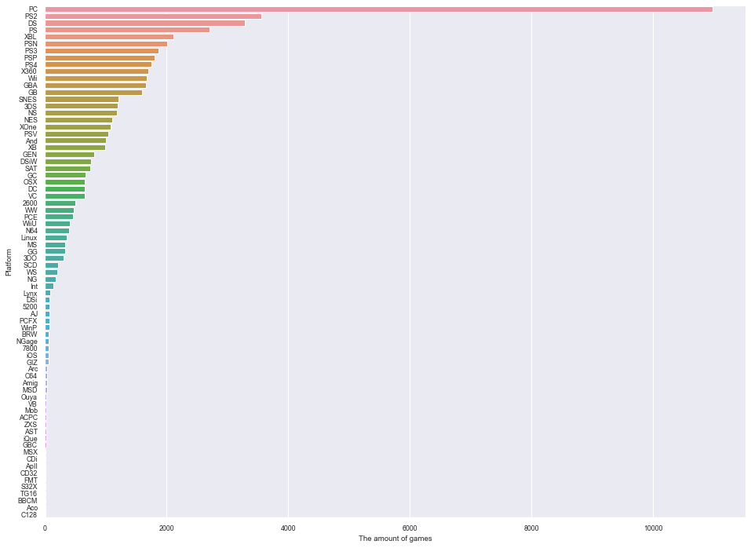

```python
import pandas as pd
import numpy as np
import matplotlib.pyplot as plt
import seaborn as sns
%matplotlib inline
```


```python
#读取文件
df = pd.read_csv('C:/Users/HughOOZ/Downloads/vgsales-12-4-2019-short.csv')
df.head()
```


<div>
<style scoped>
    .dataframe tbody tr th:only-of-type {
        vertical-align: middle;
    }

    .dataframe tbody tr th {
        vertical-align: top;
    }

    .dataframe thead th {
        text-align: right;
    }
</style>
<table border="1" class="dataframe">
  <thead>
    <tr style="text-align: right;">
      <th></th>
      <th>Rank</th>
      <th>Name</th>
      <th>Genre</th>
      <th>ESRB_Rating</th>
      <th>Platform</th>
      <th>Publisher</th>
      <th>Developer</th>
      <th>Critic_Score</th>
      <th>User_Score</th>
      <th>Total_Shipped</th>
      <th>Global_Sales</th>
      <th>NA_Sales</th>
      <th>PAL_Sales</th>
      <th>JP_Sales</th>
      <th>Other_Sales</th>
      <th>Year</th>
    </tr>
  </thead>
  <tbody>
    <tr>
      <th>0</th>
      <td>1</td>
      <td>Wii Sports</td>
      <td>Sports</td>
      <td>E</td>
      <td>Wii</td>
      <td>Nintendo</td>
      <td>Nintendo EAD</td>
      <td>7.7</td>
      <td>NaN</td>
      <td>82.86</td>
      <td>NaN</td>
      <td>NaN</td>
      <td>NaN</td>
      <td>NaN</td>
      <td>NaN</td>
      <td>2006.0</td>
    </tr>
    <tr>
      <th>1</th>
      <td>2</td>
      <td>Super Mario Bros.</td>
      <td>Platform</td>
      <td>NaN</td>
      <td>NES</td>
      <td>Nintendo</td>
      <td>Nintendo EAD</td>
      <td>10.0</td>
      <td>NaN</td>
      <td>40.24</td>
      <td>NaN</td>
      <td>NaN</td>
      <td>NaN</td>
      <td>NaN</td>
      <td>NaN</td>
      <td>1985.0</td>
    </tr>
    <tr>
      <th>2</th>
      <td>3</td>
      <td>Mario Kart Wii</td>
      <td>Racing</td>
      <td>E</td>
      <td>Wii</td>
      <td>Nintendo</td>
      <td>Nintendo EAD</td>
      <td>8.2</td>
      <td>9.1</td>
      <td>37.14</td>
      <td>NaN</td>
      <td>NaN</td>
      <td>NaN</td>
      <td>NaN</td>
      <td>NaN</td>
      <td>2008.0</td>
    </tr>
    <tr>
      <th>3</th>
      <td>4</td>
      <td>PlayerUnknown's Battlegrounds</td>
      <td>Shooter</td>
      <td>NaN</td>
      <td>PC</td>
      <td>PUBG Corporation</td>
      <td>PUBG Corporation</td>
      <td>NaN</td>
      <td>NaN</td>
      <td>36.60</td>
      <td>NaN</td>
      <td>NaN</td>
      <td>NaN</td>
      <td>NaN</td>
      <td>NaN</td>
      <td>2017.0</td>
    </tr>
    <tr>
      <th>4</th>
      <td>5</td>
      <td>Wii Sports Resort</td>
      <td>Sports</td>
      <td>E</td>
      <td>Wii</td>
      <td>Nintendo</td>
      <td>Nintendo EAD</td>
      <td>8.0</td>
      <td>8.8</td>
      <td>33.09</td>
      <td>NaN</td>
      <td>NaN</td>
      <td>NaN</td>
      <td>NaN</td>
      <td>NaN</td>
      <td>2009.0</td>
    </tr>
  </tbody>
</table>
</div>


```python
#交叉表
platGenre = pd.crosstab(df.Platform,df.Genre)
platGenreTotal = platGenre.sum(axis=1).sort_values(ascending = False)
#使用seaborn可视化
sns.set(font_scale=0.8)
plt.figure(figsize = (16,12))
sns.barplot(y = platGenreTotal.index, x = platGenreTotal.values, orient = 'h')
plt.ylabel("Platform")
plt.xlabel("The amount of games")
plt.show()
```





```python
#添加Total列
platGenre['Total'] = platGenre.sum(axis=1)
#筛选游戏数大于1000的平台
popPlatform = platGenre[platGenre['Total'] > 1000].sort_values(by ='Total',ascending = False)
needdata = popPlatform.loc[:,:'Visual Novel']
maxi = needdata.values.max()
mini = needdata.values.min()
#添加total行
popPlatformfinal = popPlatform.append(pd.DataFrame(popPlatform.sum(),columns=['total']).T,ignore_index=False)
#使用seaborn可视化
sns.set(font_scale=2)
plt.figure(figsize=(30,16))
sns.heatmap(popPlatformfinal, vmin = mini, vmax = maxi, annot = True,cmap="YlGnBu", fmt='d')
plt.xticks(rotation=90)
plt.show()
```


```python

```
