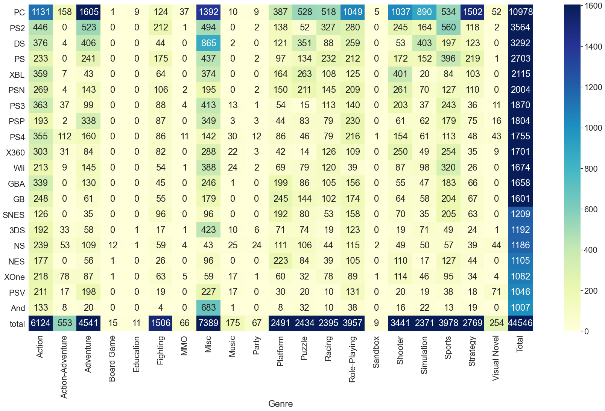

```python
import pandas as pd
import numpy as np
import matplotlib.pyplot as plt
import seaborn as sns
%matplotlib inline
```


```python
df = pd.read_csv('C:/Users/HughOOZ/Downloads/vgsales-12-4-2019-short.csv')
df.head()
```


<div>
<style scoped>
    .dataframe tbody tr th:only-of-type {
        vertical-align: middle;
    }

    .dataframe tbody tr th {
        vertical-align: top;
    }

    .dataframe thead th {
        text-align: right;
    }
</style>
<table border="1" class="dataframe">
  <thead>
    <tr style="text-align: right;">
      <th></th>
      <th>Rank</th>
      <th>Name</th>
      <th>Genre</th>
      <th>ESRB_Rating</th>
      <th>Platform</th>
      <th>Publisher</th>
      <th>Developer</th>
      <th>Critic_Score</th>
      <th>User_Score</th>
      <th>Total_Shipped</th>
      <th>Global_Sales</th>
      <th>NA_Sales</th>
      <th>PAL_Sales</th>
      <th>JP_Sales</th>
      <th>Other_Sales</th>
      <th>Year</th>
    </tr>
  </thead>
  <tbody>
    <tr>
      <td>0</td>
      <td>1</td>
      <td>Wii Sports</td>
      <td>Sports</td>
      <td>E</td>
      <td>Wii</td>
      <td>Nintendo</td>
      <td>Nintendo EAD</td>
      <td>7.7</td>
      <td>NaN</td>
      <td>82.86</td>
      <td>NaN</td>
      <td>NaN</td>
      <td>NaN</td>
      <td>NaN</td>
      <td>NaN</td>
      <td>2006.0</td>
    </tr>
    <tr>
      <td>1</td>
      <td>2</td>
      <td>Super Mario Bros.</td>
      <td>Platform</td>
      <td>NaN</td>
      <td>NES</td>
      <td>Nintendo</td>
      <td>Nintendo EAD</td>
      <td>10.0</td>
      <td>NaN</td>
      <td>40.24</td>
      <td>NaN</td>
      <td>NaN</td>
      <td>NaN</td>
      <td>NaN</td>
      <td>NaN</td>
      <td>1985.0</td>
    </tr>
    <tr>
      <td>2</td>
      <td>3</td>
      <td>Mario Kart Wii</td>
      <td>Racing</td>
      <td>E</td>
      <td>Wii</td>
      <td>Nintendo</td>
      <td>Nintendo EAD</td>
      <td>8.2</td>
      <td>9.1</td>
      <td>37.14</td>
      <td>NaN</td>
      <td>NaN</td>
      <td>NaN</td>
      <td>NaN</td>
      <td>NaN</td>
      <td>2008.0</td>
    </tr>
    <tr>
      <td>3</td>
      <td>4</td>
      <td>PlayerUnknown's Battlegrounds</td>
      <td>Shooter</td>
      <td>NaN</td>
      <td>PC</td>
      <td>PUBG Corporation</td>
      <td>PUBG Corporation</td>
      <td>NaN</td>
      <td>NaN</td>
      <td>36.60</td>
      <td>NaN</td>
      <td>NaN</td>
      <td>NaN</td>
      <td>NaN</td>
      <td>NaN</td>
      <td>2017.0</td>
    </tr>
    <tr>
      <td>4</td>
      <td>5</td>
      <td>Wii Sports Resort</td>
      <td>Sports</td>
      <td>E</td>
      <td>Wii</td>
      <td>Nintendo</td>
      <td>Nintendo EAD</td>
      <td>8.0</td>
      <td>8.8</td>
      <td>33.09</td>
      <td>NaN</td>
      <td>NaN</td>
      <td>NaN</td>
      <td>NaN</td>
      <td>NaN</td>
      <td>2009.0</td>
    </tr>
  </tbody>
</table>
</div>


```python
df.info()
```

    <class 'pandas.core.frame.DataFrame'>
    RangeIndex: 55792 entries, 0 to 55791
    Data columns (total 16 columns):
    Rank             55792 non-null int64
    Name             55792 non-null object
    Genre            55792 non-null object
    ESRB_Rating      23623 non-null object
    Platform         55792 non-null object
    Publisher        55792 non-null object
    Developer        55775 non-null object
    Critic_Score     6536 non-null float64
    User_Score       335 non-null float64
    Total_Shipped    1827 non-null float64
    Global_Sales     19415 non-null float64
    NA_Sales         12964 non-null float64
    PAL_Sales        13189 non-null float64
    JP_Sales         7043 non-null float64
    Other_Sales      15522 non-null float64
    Year             54813 non-null float64
    dtypes: float64(9), int64(1), object(6)
    memory usage: 6.8+ MB
    


```python
platGenre = pd.crosstab(df.Platform,df.Genre)
platGenreTotal = platGenre.sum(axis=1).sort_values(ascending = False)
sns.set(font_scale=0.8)
plt.figure(figsize = (16,12))
sns.barplot(y = platGenreTotal.index, x = platGenreTotal.values, orient = 'h' )
plt.ylabel = "Platform"
plt.xlabel = "The amount of games"
plt.show()
```





```python
platGenre.info()
```

    <class 'pandas.core.frame.DataFrame'>
    Index: 74 entries, 2600 to iQue
    Data columns (total 20 columns):
    Action              74 non-null int64
    Action-Adventure    74 non-null int64
    Adventure           74 non-null int64
    Board Game          74 non-null int64
    Education           74 non-null int64
    Fighting            74 non-null int64
    MMO                 74 non-null int64
    Misc                74 non-null int64
    Music               74 non-null int64
    Party               74 non-null int64
    Platform            74 non-null int64
    Puzzle              74 non-null int64
    Racing              74 non-null int64
    Role-Playing        74 non-null int64
    Sandbox             74 non-null int64
    Shooter             74 non-null int64
    Simulation          74 non-null int64
    Sports              74 non-null int64
    Strategy            74 non-null int64
    Visual Novel        74 non-null int64
    dtypes: int64(20)
    memory usage: 12.1+ KB
    


```python
platGenre['Total'] = platGenre.sum(axis=1)
popPlatform = platGenre[platGenre['Total'] > 1000].sort_values(by ='Total',ascending = False)
needdata = popPlatform.loc[:,:'Visual Novel']
maxi = needdata.values.max()
mini = needdata.values.min()
popPlatformfinal = popPlatform.append(pd.DataFrame(popPlatform.sum(),columns=['total']).T,ignore_index=False)
sns.set(font_scale=2)
plt.figure(figsize=(30,16))
sns.heatmap(popPlatformfinal, vmin = mini, vmax = maxi, annot = True,cmap="YlGnBu", fmt='d')
plt.xticks(rotation = 90)
plt.show()
```


